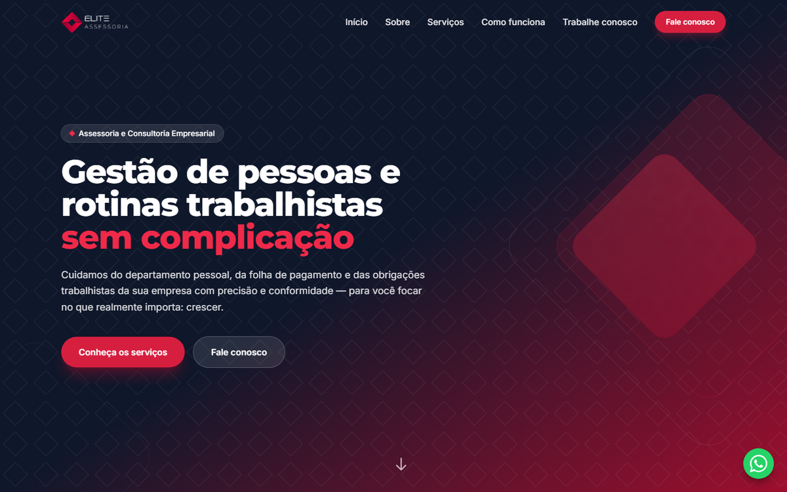

<div align="center">
  

  <h1>💼 Elite Assessoria</h1>
  <p><strong>Site institucional de assessoria e consultoria empresarial, em Recife - PE</strong></p>

  
  
  
  
</div>

---

> 🌐 **Em breve no ar** — domínio a confirmar (placeholder atual: `www.eliteassessoria.com.br`)

---

## 📸 Preview



---

## 🚀 Sobre o Projeto

**Elite Assessoria** é o site institucional de uma empresa de **assessoria e consultoria
empresarial**, especializada em gestão de departamento pessoal, folha de pagamento, eSocial,
rotinas trabalhistas, recrutamento e seleção e consultoria em gestão.

O site foi construído sobre a mesma base do
[conectividade-site](https://github.com/MrMaia/conectividade-site) — **moderno, leve e
responsivo**, com Tailwind CSS e JavaScript puro, sem bibliotecas pesadas e sem etapa de
build. Como não depende de fotografias, o design explora o **losango da logo** como
identidade visual recorrente: padrões de fundo, ícones e detalhes decorativos sobre
degradês escuros.

---

## ✨ O que foi implementado

- 🔹 **One-page responsivo** com seções de Início, Sobre, Serviços, Como funciona, Diferenciais e Contato
- 🔹 **Header dinâmico** que muda de transparente para sólido (e troca o logo) ao rolar
- 🔹 **9 serviços** gerados dinamicamente a partir de um array em JavaScript, com ícones SVG
- 🔹 **Barra de estatísticas** com contadores animados (count-up via `IntersectionObserver`)
- 🔹 **Animações de scroll** suaves com `IntersectionObserver` (nativo, sem libs)
- 🔹 **Dois formulários** (Contato e Trabalhe Conosco) enviados via `fetch` com validação nativa
- 🔹 **Modal** de envio de currículo com upload de arquivo e gestão de foco (teclado/leitor de tela)
- 🔹 **"Solicitar proposta"** nos cards pré-preenche o assunto do formulário com o serviço clicado
- 📱 **Menu mobile** e **botão flutuante de WhatsApp** (que some quando a seção de contato está visível)
- ♿ **Acessibilidade** — skip link, landmarks, `aria-*`, foco visível e `prefers-reduced-motion`
- 🔎 **SEO completo** — meta tags, Open Graph, Twitter Card e dados estruturados (JSON-LD)
- 🗺️ **Mapa do Google** integrado e contador de anos de experiência automático

---

## 🛠️ Tecnologias

| Tecnologia | Uso |
|---|---|
| HTML5 | Estrutura semântica da página |
| Tailwind CSS (CDN) | Estilização utilitária e responsividade |
| JavaScript (vanilla) | Interatividade, serviços, formulários e animações |
| Google Fonts | Tipografia (Montserrat + Inter) |
| Schema.org (JSON-LD) | Dados estruturados para SEO local |
| Google Maps | Localização da empresa |

---

## 📁 Estrutura do Projeto

```
public_html/
├── index.html          # Página única (Início, Sobre, Serviços, Processo, Diferenciais, Contato)
├── robots.txt          # Diretrizes para crawlers
├── sitemap.xml         # Mapa do site
├── README.md
└── assets/
    ├── js/
    │   └── site.js     # Toda a interatividade do site
    └── images/         # Logos (logo.png, logo-light.png), favicon e preview
```

---

## ⚙️ Como Executar Localmente

1. Clone o repositório:
   ```bash
   git clone https://github.com/MrMaia/elitegestao.git
   ```

2. Por ser um site estático, basta servir a pasta:
   ```bash
   python -m http.server 8000
   # ou
   npx serve .
   ```

3. Acesse [http://localhost:8000](http://localhost:8000).

> Os formulários enviam para um handler externo de e-mail e exigem conexão com a internet.

---

## 📦 Deploy

Publicar o conteúdo da pasta na **raiz** (`public_html`) do servidor web. Os caminhos são
relativos, portanto a pasta deve ser servida como raiz do domínio.

---

## 📋 Pendências

- [ ] **E-mail**: `contato@eliteassessoria.com.br` é placeholder — `index.html` (contato, footer, JSON-LD)
- [ ] **Domínio**: `https://www.eliteassessoria.com.br/` é placeholder — `index.html` (canonical, OG, Twitter, JSON-LD), `robots.txt` e `sitemap.xml`
- [ ] **Ano de fundação**: constante `ANO_FUNDACAO = 2014` em `assets/js/site.js` (alimenta o contador "anos de experiência")
- [ ] **Estatísticas**: números da barra de stats (`data-count` em `index.html`) são ilustrativos — confirmar valores reais

> 💡 **Recomendação futura:** o site usa o Tailwind Play CDN para manter a base sem build.
> Para produção em escala, o ideal é compilar o CSS com o Tailwind CLI
> (`npx tailwindcss -o assets/css/site.css --minify`) e trocar o script do CDN por um
> `<link rel="stylesheet">` — elimina o flash de página sem estilo e melhora o carregamento.

---

<div align="center">
  <p>Feito com ❤️ por <strong>AMS Tech</strong></p>
</div>
